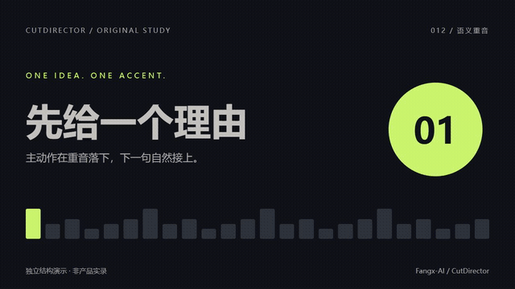
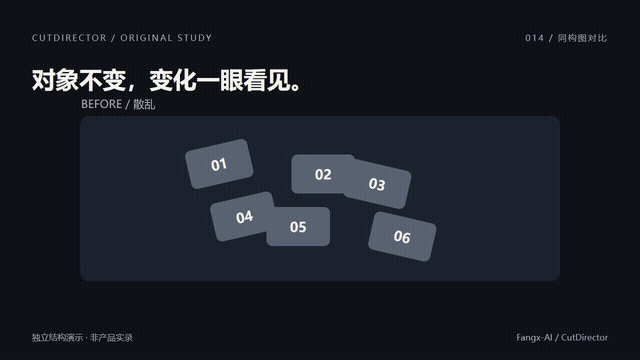
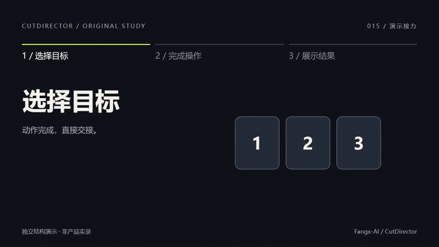

# Prompt 演示画廊

[返回首页](README.md) · [完整 Prompt 展示](PROMPTS.md) · [官方效果参考](VISUAL-GALLERY.md)

直接看效果，找到喜欢的镜头，再打开对应 Prompt 替换内容。每张预览都是动态 GIF；点击预览或“完整视频”可打开 MP4，012 提供带配乐的版本。

<table>
<tr>
<td width="50%" valign="top">
<h3>001 · 手势触发 Logo</h3>
<a href="assets/verified-prompts/prompt-001-gesture-logo-pop.mp4"></a>
<p>认出品牌 · 准备：官方 Logo + 真实手势</p>
<p><a href="references/prompt-001-gesture-logo-pop.md">复制 Prompt →</a> · <a href="assets/verified-prompts/prompt-001-gesture-logo-pop.mp4">完整视频</a></p>
</td>
<td width="50%" valign="top">
<h3>002 · 分屏要点与长文</h3>
<a href="assets/verified-prompts/prompt-002-split-screen-explainer.mp4"></a>
<p>解释观点 · 准备：逐字文案</p>
<p><a href="references/prompt-002-split-screen-explainer.md">复制 Prompt →</a> · <a href="assets/verified-prompts/prompt-002-split-screen-explainer.mp4">完整视频</a></p>
</td>
</tr>
<tr>
<td width="50%" valign="top">
<h3>003 · 品牌能力递进</h3>
<a href="assets/verified-prompts/prompt-003-brand-mode-comparison.mp4"></a>
<p>解释变化 · 准备：官方 Logo + 两种模式</p>
<p><a href="references/prompt-003-brand-mode-comparison.md">复制 Prompt →</a> · <a href="assets/verified-prompts/prompt-003-brand-mode-comparison.mp4">完整视频</a></p>
</td>
<td width="50%" valign="top">
<h3>004 · 自适应章节导航</h3>
<a href="assets/verified-prompts/prompt-004-top-chapter-progress-rail.mp4"></a>
<p>连接段落 · 准备：全片结构与时间</p>
<p><a href="references/prompt-004-top-chapter-progress-rail.md">复制 Prompt →</a> · <a href="assets/verified-prompts/prompt-004-top-chapter-progress-rail.mp4">完整视频</a></p>
</td>
</tr>
<tr>
<td width="50%" valign="top">
<h3>005 · 原素材瀑布墙</h3>
<a href="assets/verified-prompts/prompt-005-diagonal-card-waterfall.mp4"></a>
<p>展示广度 · 准备：指定源视频，不可换卡片内容</p>
<p><a href="references/prompt-005-diagonal-card-waterfall.md">复制 Prompt →</a> · <a href="assets/verified-prompts/prompt-005-diagonal-card-waterfall.mp4">完整视频</a></p>
</td>
<td width="50%" valign="top">
<h3>006 · 三卡翻面</h3>
<a href="assets/verified-prompts/prompt-006-editable-three-card-flip.mp4"></a>
<p>解释变化 · 准备：三组正反面内容</p>
<p><a href="references/prompt-006-editable-three-card-flip.md">复制 Prompt →</a> · <a href="assets/verified-prompts/prompt-006-editable-three-card-flip.mp4">完整视频</a></p>
</td>
</tr>
<tr>
<td width="50%" valign="top">
<h3>007 · 真实页面焦点锁定</h3>
<a href="assets/verified-prompts/prompt-007-hd-page-focus-lock.mp4"></a>
<p>证明结果 · 准备：高清截图或录屏</p>
<p><a href="references/prompt-007-hd-page-focus-lock.md">复制 Prompt →</a> · <a href="assets/verified-prompts/prompt-007-hd-page-focus-lock.mp4">完整视频</a></p>
</td>
<td width="50%" valign="top">
<h3>008 · 图片卡组与主卡</h3>
<a href="assets/verified-prompts/prompt-008-real-image-deck-hero.mp4"></a>
<p>展示选择 · 准备：3–5 张真实图片</p>
<p><a href="references/prompt-008-real-image-deck-hero.md">复制 Prompt →</a> · <a href="assets/verified-prompts/prompt-008-real-image-deck-hero.mp4">完整视频</a></p>
</td>
</tr>
<tr>
<td width="50%" valign="top">
<h3>009 · 输入、反馈、结果</h3>
<a href="assets/verified-prompts/prompt-009-input-feedback-result.mp4"></a>
<p>解释因果 · 准备：三拍文案，可选结果图</p>
<p><a href="references/prompt-009-input-feedback-result.md">复制 Prompt →</a> · <a href="assets/verified-prompts/prompt-009-input-feedback-result.mp4">完整视频</a></p>
</td>
<td width="50%" valign="top">
<h3>010 · 三段式数字片头</h3>
<a href="assets/prompt-examples/prompt-010-three-stage-count-hook.mp4"></a>
<p>抓住注意 · 准备：消息、数量、观众收益</p>
<p><a href="references/prompt-010-three-stage-count-hook.md">复制 Prompt →</a> · <a href="assets/prompt-examples/prompt-010-three-stage-count-hook.mp4">完整视频</a></p>
</td>
</tr>
<tr>
<td width="50%" valign="top">
<h3>011 · 任务推进看板</h3>
<a href="assets/prompt-examples/prompt-011-task-board-progression.mp4"></a>
<p>解释流程 · 准备：真实任务状态</p>
<p><a href="references/prompt-011-task-board-progression.md">复制 Prompt →</a> · <a href="assets/prompt-examples/prompt-011-task-board-progression.mp4">完整视频</a></p>
</td>
<td width="50%" valign="top">
<h3>012 · 语义重音与音乐落点</h3>
<a href="assets/prompt-examples/prompt-012.mp4"></a>
<p>抓住注意 · 准备：已有音乐 + 强调词</p>
<p><a href="references/prompt-012-semantic-audio-accent.md">复制 Prompt →</a> · <a href="assets/prompt-examples/prompt-012.mp4">完整视频 · 有声</a></p>
</td>
</tr>
<tr>
<td width="50%" valign="top">
<h3>013 · 短句累积与兑现</h3>
<a href="assets/prompt-examples/prompt-013.mp4"></a>
<p>解释递进 · 准备：2–4 条短句 + 结论</p>
<p><a href="references/prompt-013-incremental-payoff.md">复制 Prompt →</a> · <a href="assets/prompt-examples/prompt-013.mp4">完整视频</a></p>
</td>
<td width="50%" valign="top">
<h3>014 · 同构图前后对比</h3>
<a href="assets/prompt-examples/prompt-014.mp4"></a>
<p>证明结果 · 准备：同一对象前后素材</p>
<p><a href="references/prompt-014-matched-before-after.md">复制 Prompt →</a> · <a href="assets/prompt-examples/prompt-014.mp4">完整视频</a></p>
</td>
</tr>
<tr>
<td width="50%" valign="top">
<h3>015 · 真实演示连续接力</h3>
<a href="assets/prompt-examples/prompt-015.mp4"></a>
<p>连接段落 · 准备：真实演示片段与语义锚点</p>
<p><a href="references/prompt-015-demo-relay.md">复制 Prompt →</a> · <a href="assets/prompt-examples/prompt-015.mp4">完整视频</a></p>
</td>
<td width="50%" valign="top"><h3>把效果用到你的口播里</h3><p>选中一条，提供目标句子或时间段，让助手沿用你的原声和风格制作。</p><p><a href="references/user-guide.md">查看使用指南 →</a></p></td>
</tr>
</table>

## 一句话开始

```text
使用 $cut-director，参考 Prompt [编号] 处理 [目标句子或时间段]。
沿用我的原声和项目风格，先做一个片段给我看。
```

需要竖版、4:3 或页面跟随放大时，查看[画幅与焦点变体](references/prompt-variants.md)。素材要求、替换项和演示说明都在各自的 Prompt 详情页。
