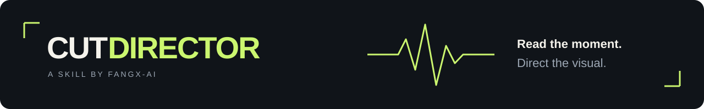

<div align="center">



# CutDirector

**让口播里的重点，变成观众看得懂的画面。**

面向 ChatCut 的导演 Skill 与可复用 Prompt 库。读懂原声和真实素材，选择合适的视觉动作，做出可继续编辑的镜头。

[](PROMPT-LIBRARY.md)
[](PROMPT-LIBRARY.md)
[](VISUAL-GALLERY.md)

[看效果](#先看效果) · [开始使用](#开始使用) · [选一个 Prompt](PROMPT-LIBRARY.md) · [使用指南](references/user-guide.md) · [参与贡献](CONTRIBUTING.md)

</div>

<a id="已验证效果"></a>

## 先看效果

<table>
<tr>
<td width="50%"><a href="references/prompt-001-gesture-logo-pop.md"></a><br><strong>让品牌跟随手势出现</strong><br>001 · ChatCut 已验证</td>
<td width="50%"><a href="references/prompt-010-three-stage-count-hook.md"></a><br><strong>三句话说清为什么值得看</strong><br>010 · 本地演示</td>
</tr>
<tr>
<td width="50%"><a href="references/prompt-012-semantic-audio-accent.md"></a><br><strong>让声音和画面一起落下</strong><br>012 · 本地演示 · <a href="assets/prompt-examples/prompt-012.mp4">听有声版</a></td>
<td width="50%"><a href="references/prompt-013-incremental-payoff.md"></a><br><strong>一句接一句，最后兑现</strong><br>013 · 本地演示</td>
</tr>
</table>

[查看全部 15 条素材与使用条件 →](PROMPT-LIBRARY.md)

## 什么时候用

你已经拍好口播、教程、访谈或产品讲解，希望观众更快看懂重点：

| 你遇到的问题 | 可以这样说 |
|---|---|
| 不知道哪里值得加画面 | “找出最值得强化的 3 句话，解释为什么。” |
| 全片都是字幕，太单调 | “把这个对比变成一个看得懂的变化，沿用当前风格。” |
| 网站演示看不清重点 | “跟着讲解锁定真实页面的操作区域。” |
| 句与句之间松散 | “让这三句的画面递进，别每句都重新入场。” |
| 已有镜头需要调整 | “沿用这版，把字放大，结尾更紧一点。” |

保留你的原声、真实素材和已确认的风格。需要完整脚本创作、通用混剪或发布工作流时，应使用对应工具；本 Skill 聚焦口播中的视觉与局部节奏。

<a id="30-秒开始"></a>

## 开始使用

**1. 安装。** 在支持 Skill Installer 的 Codex 中发送：

```text
$skill-installer install https://github.com/Fangx-AI/cut-director
```

安装后重启 Codex。没有 Installer 时，使用[手动安装说明](references/user-guide.md#安装与更新)。

**2. 准备素材。** 连接 ChatCut 并打开目标项目，或先提供视频、逐字稿、目标句子。只有逐字稿也能做方案；执行需要可访问的媒体和相应工具。

**3. 发出第一条指令。**

```text
使用 $cut-director 分析当前口播，找出最值得加画面的 3 个时刻。
沿用我的原声和项目风格，先给出简短方案，再做一个代表镜头给我看。
```

你会得到：**适合哪些句子 → 每处观众能看懂什么 → 一个代表片段 → 确认后扩展**。内部参数由助手处理；信息不足时，只补真正影响结果的输入。ChatCut 连接与生成费用由相应宿主提供，本 Skill 不包含生成额度。

## 为什么保留这个 Skill

**选择有依据。** 按口播语义和真实构图选择效果，让动作解释内容：比较、递进、因果、强调或结果揭示。

**素材可以继续改。** 效果页提供完整 Prompt、替换项和限制；原生 MG 保留适用的可编辑字段，本地演示提供源代码，并明确兼容范围。

**修改延续已接受的结果。** 调位置、改文案或缩短动画时沿用已确认方向，检查受影响片段；不会把每次小改都当成新创意项目。

**验证范围看得见。** 9 条 ChatCut 已验证素材、6 条本地演示、123 条官方参考分别标记。样例好看不等于所有内容都适配，脚本通过也不等于声音和画面都通过。

## 更多入口

| 想做什么 | 从这里开始 |
|---|---|
| 按问题选效果 | [Prompt 索引](PROMPT-LIBRARY.md) |
| 连续浏览已有完整 Prompt | [001–011 展示](PROMPTS.md) |
| 做竖版、4:3 或局部变体 | [画幅与焦点变体](references/prompt-variants.md) |
| 查看官方灵感 | [视觉参考画廊](VISUAL-GALLERY.md) |
| 安装、修改或排查问题 | [使用指南](references/user-guide.md) |
| 理解最新宿主差异 | [兼容说明](references/compatibility.md) |
| 贡献你的效果 | [贡献指南](CONTRIBUTING.md) |
| 看本次更新 | [更新记录](CHANGELOG.md) |

## 开源、原创与商用

CutDirector 鼓励真实使用、改进和传播，但不允许抹去作者、闭源搬运原创成果或冒充官方项目。

| 内容 | 授权与边界 |
| --- | --- |
| 程序、Schema 与测试 | [AGPL-3.0-or-later](LICENSES/AGPL-3.0-or-later.txt)：修改、分发或通过网络提供时须遵守相应开源义务 |
| `SKILL.md`、原创 Prompt、配方与方法论文档 | [CC BY-SA 4.0](LICENSES/CC-BY-SA-4.0.txt)：允许转载、改编和商用，但必须署名、标明修改，并以相同协议分享改编内容 |
| 用户用 CutDirector 制作的成片 | 成片不会仅因使用 CutDirector 而自动适用上述许可证；用户可以将自己拥有权利的成片用于商业用途 |
| CutDirector 名称与品牌 | 不得用于冒充官方、制造合作或授权假象，详见[品牌政策](TRADEMARKS.md) |
| 演示视频、人物素材、ChatCut 官方图库与第三方 Logo | 不在项目开源授权范围内，详见[第三方声明](THIRD_PARTY_NOTICES.md) |

转载或改编原创 Prompt 时，请保留：

```text
CutDirector by Fangx-AI
https://github.com/Fangx-AI/cut-director
Licensed under CC BY-SA 4.0. Changes, if any, must be identified.
```

完整边界请以 [`LICENSE`](LICENSE)、[`NOTICE`](NOTICE)、[`TRADEMARKS.md`](TRADEMARKS.md) 和 [`THIRD_PARTY_NOTICES.md`](THIRD_PARTY_NOTICES.md) 为准。


## 开发与验证

```sh
python scripts/validate_talkdirector.py
python -m unittest discover -s tests
python scripts/check_local_links.py
```

验证器检查数据与执行合同；实际画面和声音仍需要对应宿主验证。[Skill 定义](SKILL.md) · [演示源文件](assets/prompt-examples/source/README.md) · [测试说明](tests/forward-results.md)
