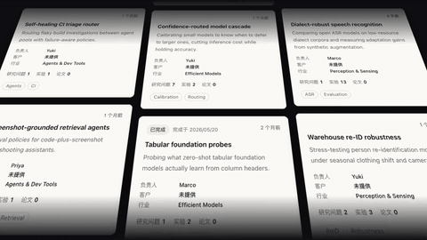
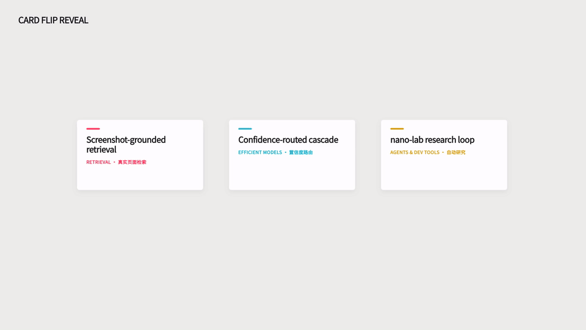
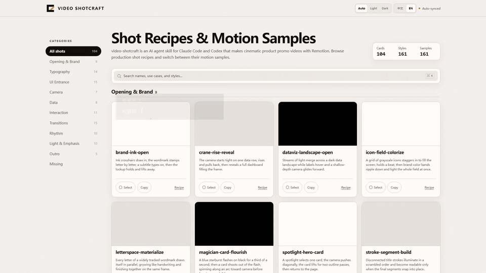
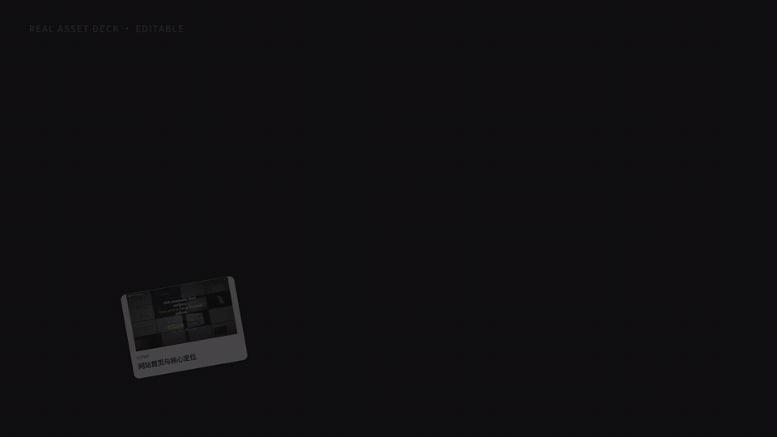
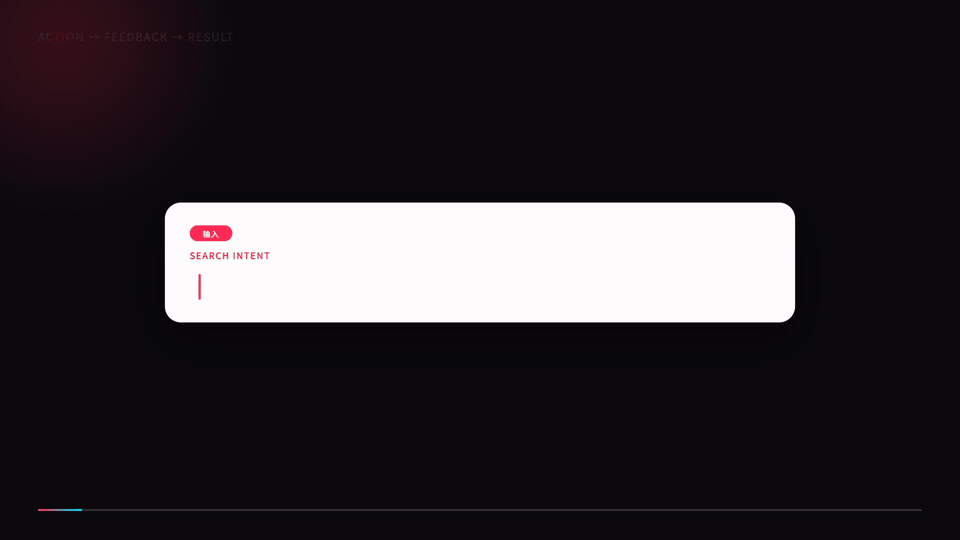

<div align="center">


# CutDirector

**专为已拍口播视频设计的 ChatCut 口播导演 Skill**

读懂逐字稿、人物动作和真实画面，在真正值得强化的时刻加入重点文字、Logo、图表、网页、分屏与补充画面。

你只需要描述想看到的结果。CutDirector 会先做一个可编辑的代表镜头，满意后再扩展到其他位置。

[](#已验证效果)
[](VISUAL-GALLERY.md)
[](https://chatcut.io/)
[](LICENSE)
[](LICENSE)

[查看真实效果与 Prompt](#已验证效果) · [30 秒开始](#30-秒开始) · [浏览效果参考库](VISUAL-GALLERY.md) · [开源与原创保护](#开源原创与商用)

</div>

## 已验证效果

每个 Verified Prompt 都来自真实的 ChatCut 时间线：先完成、再验证，最后才公开为可复用 Prompt。

### Prompt 001 · 手势触发 Logo 弹出

[](assets/verified-prompts/prompt-001-gesture-logo-pop.mp4)

**快速使用**

```text
当人物分别指向左右时，在左侧弹出 [品牌 A] 官方 Logo，右侧弹出 [品牌 B] 官方 Logo。先做这个片段给我看。
```

适合品牌对比、工具介绍和产品推荐。CutDirector 会在内部查找真实手势、验证官方素材、保护人物与字幕，并检查入场和退场。

<details>
<summary><strong>查看完整精确 Prompt</strong></summary>

```text
在 [时间段]，给人物两侧的指向手势添加 [品牌 A] 和 [品牌 B] 的官方 Logo 弹出特效：[品牌 A] 在画面左侧，[品牌 B] 在画面右侧，分别跟随对应手指抬起时弹出，手势结束时退场。请自动获取可验证的官方 Logo，保持人物全屏，不遮挡脸、字幕、手和产品，并先展示关键帧让我确认。
```

</details>

[查看 Prompt 001 的完整说明](references/prompt-001-gesture-logo-pop.md)

### Prompt 002 · 双栏讲解

[](assets/verified-prompts/prompt-002-split-screen-explainer.mp4)

**快速使用**

```text
把这段做成双栏讲解：左边按照口播依次出现重点，右边缓慢滚动完整资料。
```

适合 Prompt、代码、报告、合同和论文讲解。左侧负责结论，右侧只承担“完整材料正在流动”的证据作用。

<details>
<summary><strong>查看完整精确 Prompt</strong></summary>

```text
在 [时间段] 制作一段横屏双栏信息动效。左侧作为主视觉，显示标题「[标题]」，并让 [3-5 个要点] 按照叙述顺序逐条浮现：当前项高亮，历史项降低亮度保留，最后进入全部完成状态。右侧作为辅助信息区，放入 [完整长文本] 并让文字持续、匀速、缓慢地由下向上滚动。长文本不要求在视频结束前展示完，不要为了滚完全文而加快速度。右侧宽度不得超过画面的 45%，保持原视频时长和画幅，并先展示开始、中段和结束关键帧让我确认。
```

</details>

[观看 Prompt 002 演示视频](assets/verified-prompts/prompt-002-split-screen-explainer.mp4) · [查看完整说明](references/prompt-002-split-screen-explainer.md)

### Prompt 003 · 品牌双模式能力对比

[](assets/verified-prompts/prompt-003-brand-mode-comparison.mp4)

**快速使用**

```text
把这段做成品牌双模式对比：顶部保留官方图标，左边只放 [模式 A] 的一个核心能力，右边让 [模式 B] 的能力逐项落下，最后收束成「[能力 A] → [最终结果 B]」。使用纯黑背景和轻快卡点，图标不要单独淡出。
```

适合普通版与专业版、聊天模式与办公模式、免费版与付费版等双模式讲解。它用一个品牌图标维持身份连续性，以非对称信息量强调能力差异，并在结尾把多项功能压缩为一句结果。

<details>
<summary><strong>查看完整精确 Prompt</strong></summary>

```text
在 [时间段] 制作一段横屏全屏品牌双模式对比动效。

使用纯黑背景，顶部居中放置 [品牌] 的可验证官方图标。图标作为整段的品牌锚点，贯穿两个信息阶段，不要在中间转场时单独淡出或重新出现。

第一阶段并排展示两种模式：左侧标题「[模式 A]」，只保留一项核心能力「[能力 A]」；右侧标题「[模式 B]」，按照口播顺序依次出现 2-4 项能力。左侧使用中性灰弱化，右侧使用一个高亮强调色，不添加小号英文装饰。

第二阶段让第一阶段的标题和能力块一起退场，品牌图标保持稳定，然后把画面收束为「[能力 A] → [最终结果 B]」，下方补充一句「[总结句]」。音效使用轻、短、清脆的卡点，避免低沉 boom、机械拖尾和连续 whoosh。先展示第一阶段、能力递进、中间转场、最终结论和导出成片的实际第一帧让我确认；独立导出时，第一帧不得露出上一镜。
```

</details>

[观看 Prompt 003 演示视频](assets/verified-prompts/prompt-003-brand-mode-comparison.mp4) · [查看完整说明](references/prompt-003-brand-mode-comparison.md)

### Prompt 004 · 自适应章节导航与全片进度条

[](assets/verified-prompts/prompt-004-top-chapter-progress-rail.mp4)

**快速使用**

```text
分析这条视频的结构、画幅和安全区，自适应选择完整章节导航、当前章节、纯进度或保持干净。只要显示进度，就必须从头到尾连续运行，跨章节和镜头不清零。
```

它不预设日报、课程、访谈或任何固定题材，也不默认横屏、顶部位置或深色科技风。CutDirector 会根据真实章节、标签密度、横竖画幅、人物与 UI 安全区选择合适形态；没有可靠章节时不虚构章节，没有安全区或观看价值时保持干净。

<details>
<summary><strong>查看核心精确 Prompt</strong></summary>

```text
分析 [整条视频或确认时间段] 的实际内容、画幅、节奏和安全区，为它添加一条自适应的“章节或段落导航 + 全片进度”信息条。

先识别视频是否存在真实章节，再选择完整章节导航、当前章节模式、纯进度模式或保持干净。位置顶部优先但不固定，视觉语言继承原片，不套用固定题材、画幅、坐标或科技风。

只要显示进度，就从第一帧 0% 开始，按真实播放时间连续填充，到最后一帧达到 100%；跨章节和镜头绝不清零、回跳、提前跑满或重复入场。先提交结构、形态和安全区依据，再展示代表帧与实时预览让我确认。
```

</details>

[观看 Prompt 004 演示视频](assets/verified-prompts/prompt-004-top-chapter-progress-rail.mp4) · [查看完整说明](references/prompt-004-top-chapter-progress-rail.md)

### Prompt 005 · 斜向卡片滚动（真实源视频复用）

[](assets/verified-prompts/prompt-005-diagonal-card-waterfall.mp4)

**快速使用**

```text
在 [目标时间段] 使用 page-waterfall-wall 斜向卡片滚动镜头。先检查目标网站、官方演示和当前 ChatCut 素材库；如果存在来源可验证的 `page-waterfall-wall.mp4`，直接导入原视频，不重新生成、重绘或用 Motion Graphic 复刻。

保留源视频的 1920×1080、30fps、约 5 秒时长、原始播放速度和完整画面，不添加标题、字幕、角标、品牌包装、粒子、故障或其他覆盖层。目标画幅不一致时只做最小必要适配，禁止拉伸、变速和无意义裁切。

如果没有可验证的源视频，就保持画面干净并请求源文件。只有用户明确同意，而且具备真实网站截图或真实录屏时，才允许先做一个代表镜头复刻；不得生成、重绘或虚构产品 UI。

先展示首帧、中段和尾帧，确认来源、画面完整、无覆盖、无裁切、无黑边后，以 H.264、1080p、30fps 导出。
```

**类型：真实源视频复用型。** 它适合网站合集、产品案例、作品集和界面功能的高密度视觉展示，但不是可编辑卡片模板。卡片文字、图片和运动已经存在于源视频中，用户不能通过 Prompt 005 替换；需要更换卡片内容时应使用另一条可编辑 Motion Graphic Prompt。

<details>
<summary><strong>查看核心精确 Prompt</strong></summary>

```text
在 [目标时间段] 使用 page-waterfall-wall 斜向卡片滚动镜头。

先检查目标网站、官方演示和当前 ChatCut 素材库。若已经存在网站提供或官方来源的 `page-waterfall-wall.mp4`，直接导入并使用原视频，不重新生成、重绘或用 Motion Graphic 复刻。

保留原素材的 1920×1080、30fps、约 5 秒时长、播放速度和完整画面，不添加大标题、字幕、角标、品牌包装、粒子、故障或其他覆盖层。只有在目标画幅不一致时才做最小必要适配，禁止拉伸和无意义裁切。

只有确认不存在可用的真实源视频，并且得到用户明确同意后，才可以用真实网站截图或真实录屏复刻；不得生成、重绘或虚构产品 UI。无法取得可靠素材时保持画面干净并请求源文件。

先展示首帧、中段和尾帧，确认来源、画面完整、无覆盖、无裁切、无黑边后，以 H.264、1080p、30fps 导出。
```

</details>

[观看 Prompt 005 演示视频](assets/verified-prompts/prompt-005-diagonal-card-waterfall.mp4) · [查看完整说明](references/prompt-005-diagonal-card-waterfall.md)

### Prompt 006 · 浅灰三卡翻面（正反面可编辑）

[](assets/verified-prompts/prompt-006-editable-three-card-flip.mp4)

**快速使用**

```text
在 [目标时间段] 复刻原版浅灰三卡翻面镜头。使用 1920×1080、30fps、3 秒画布，在 #EDEDEB 浅灰背景上水平居中排列三张 414×230 白色卡片，保留左上角小标题、原版间距、轻阴影和从左到右的错峰节奏。

分别使用以下内容：
- 卡片 1 正面：[正面内容]；卡片 1 背面：[背面内容]
- 卡片 2 正面：[正面内容]；卡片 2 背面：[背面内容]
- 卡片 3 正面：[正面内容]；卡片 3 背面：[背面内容]

六个卡面必须独立可编辑。未填写的可选字段直接隐藏并自动回流，不得显示骨架线、空白图片区或占位内容；所有文字保留为 Motion Graphic 文字属性，不得烘焙进图片或视频。

三张卡分别从第 20、32、44 帧开始进行 16 帧的 Y 轴原地翻转，只在接近 90° 的最窄边缘态切换正反面。背面落稳后必须正向可读，禁止镜像、反字和闪回；第 60 帧全部完成并保持到结尾。

不要改变原版视觉，不添加深色背景、玻璃拟态、辉光、粒子、随机旋转或夸张弹跳。先检查正面稳定态、三次边缘态、三张背面和最终保持帧，再导出成片。
```

适合把三个功能、方案或案例依次揭示为三个结果。它保留已经验收的浅灰背景、三卡尺寸、间距和从左到右错峰节奏；演示里的文字和数字只是示例，用户可以分别替换六个卡面的文字、图片与强调色，未填写字段会隐藏并自动回流。

<details>
<summary><strong>查看核心精确 Prompt</strong></summary>

```text
在 [目标时间段] 制作一段原版浅灰三卡依次翻面镜头。保留三张横向并排的白色卡片、浅灰背景、左上角小标题，以及原版的卡片尺寸、间距、层级、透视和从左到右错峰节奏；固定三张卡片，不自动增减，也不要重新设计成深色、玻璃拟态或其他视觉风格。

三张卡片的正面和背面必须分别独立可编辑。请使用以下内容：
- 卡片 1 正面：[正面内容]；卡片 1 背面：[背面内容]
- 卡片 2 正面：[正面内容]；卡片 2 背面：[背面内容]
- 卡片 3 正面：[正面内容]；卡片 3 背面：[背面内容]

每个卡面可填写标题、副标题、分类、说明、指标和用户提供或项目中已验证的图片。未填写的可选字段直接隐藏并自动回流，禁止留下骨架线、灰色占位块、空白图片区或伪造内容；每个卡面至少保留一项真实、可读的内容。所有文案都保留为 Motion Graphic 可编辑文字图层，不得烘焙进 PNG、截图或视频。图片只使用用户提供或项目中已验证的真实素材，不生成、重绘或虚构产品 UI。

翻转使用 Y 轴原地翻面：先稳定展示三张正面，再让卡片 1、2、3 依次翻转。只有卡片接近 90°、画面最窄的边缘态时才能切换正反面；背面落稳后必须正向可读，禁止镜像字、反字或在翻转中途闪回另一面。独立演示默认使用 1920×1080、30fps、3 秒：正面保持到第 20 帧，三张卡分别从第 20、32、44 帧开始翻转，每张用 16 帧完成，全部背面在第 60 帧落稳并保持到结尾。目标时长不足时优先延长片段、精简卡面文案或依次完成翻转，不得靠过度加速牺牲可读性。

不添加辉光、粒子、玻璃拟态、随机旋转、夸张弹跳、大标题或无关装饰。先展示正面稳定态、至少一个 90° 边缘态、每张背面落稳后的状态和最终保持帧，并提供实时播放预览让我确认；导出前再次检查六个卡面的文字与图片都能独立修改。
```

</details>

[观看 Prompt 006 演示视频](assets/verified-prompts/prompt-006-editable-three-card-flip.mp4) · [查看完整说明](references/prompt-006-editable-three-card-flip.md)

### Prompt 007 · 高清页面输入标注与焦点锁定

[](assets/verified-prompts/prompt-007-hd-page-focus-lock.mp4)

**快速使用**

```text
在 [目标时间段] 制作 1920×1080、30fps、2.5 秒的“高清页面输入标注与焦点锁定”镜头。底层只使用用户提供或项目中已验证、分辨率不低于输出的 [真实页面截图/录屏]，按 1:1 或 contain 完整显示；禁止放大低清图、AI 重绘、虚构产品 UI、拉伸或无意义裁切。

上方添加透明 Motion Graphic 讲解层，把 [编辑标注]、[字段标签]、[输入文字]、[焦点标签]、颜色、遮罩强度、焦点框 X/Y/宽/高/圆角与标注面板位置全部开放为可编辑属性。可选标签留空后隐藏并回流；新增标签必须明确属于后期讲解，不能冒充网站原生 UI。

第 0–14 帧标注面板入场，第 8–34 帧逐字输入，第 14–30 帧压暗非重点区，第 20–38 帧锁定焦点框，第 28–42 帧显示焦点标签，第 42–74 帧稳定保持。焦点框准确贴合 [目标区域]，不遮挡正文，也不用过度模糊或大幅推拉代替聚焦。

先在 100% 尺度检查页面清晰度，再核对首帧、输入中段、遮罩、焦点框和最终保持帧，确认标注与原生 UI 边界明确后再导出。
```

适合演示搜索、筛选、定位功能和页面重点。真实页面负责事实证据，Motion Graphic 只负责可编辑的后期讲解；没有清晰真实素材时，Prompt 会请求原图或录屏，不会画一个“看起来像真的”网站。

[观看 Prompt 007 演示视频](assets/verified-prompts/prompt-007-hd-page-focus-lock.mp4) · [查看完整说明](references/prompt-007-hd-page-focus-lock.md)

### Prompt 008 · 真实图片卡组飞入与主卡落位

[](assets/verified-prompts/prompt-008-real-image-deck-hero.mp4)

**快速使用**

```text
在 [目标时间段] 制作 1920×1080、30fps、3 秒的“真实图片卡组飞入与主卡落位”镜头。提供 3–5 张用户或项目中来源可验证的真实图片，以及每张卡各自的 [标签]、[标题] 和 [主卡序号]。cardCount 必须等于真实图片数量，heroIndex 必须有效；禁止重复图片凑数、生成或重绘产品 UI、空白图片区、骨架线和占位词。

每张图片、标签、标题以及场景标签、背景色、卡片色、文字色、强调色和字体均独立可编辑。图片统一 contain 完整显示；可选标签为空时隐藏并回流。3、4、5 张卡分别使用约 430×318、355×276、292×242 的卡面。

每张卡从第 index×3 帧开始用 12 帧飞入，第 16–48 帧收束为稳定扇形，背景第 0–42 帧由深到浅，主卡第 30–52 帧抬升到约 1.12 倍，第 52–89 帧稳定保持。不要添加随机旋转、粒子、辉光、无关大标题或连续弹跳。

先逐张核对图片来源和标题，再检查首卡飞入、卡组收束、主卡抬升和最终保持帧；确认 contain 无裁切、主卡序号正确后再导出。
```

适合作品集、案例合集、网站功能和产品截图的高密度展示。复用的是卡组运动与主次层级，演示中的图片和文案不是固定内容。

[观看 Prompt 008 演示视频](assets/verified-prompts/prompt-008-real-image-deck-hero.mp4) · [查看完整说明](references/prompt-008-real-image-deck-hero.md)

### Prompt 009 · 输入—反馈—结果三拍因果链

[](assets/verified-prompts/prompt-009-input-feedback-result.mp4)

**快速使用**

```text
在 [目标时间段] 制作 1920×1080、30fps、3.5 秒的“输入 → 反馈 → 结果”三拍因果镜头。填写 [输入文字]、[反馈短句]、[结果标题]，并可选填写场景标签、步骤标签、眉题、结果说明、元信息和 [真实结果图片]；文字、颜色、字体与图片全部独立可编辑。

所有文字保留为 Motion Graphic 属性，不得烘焙进图片或视频。可选字段留空后隐藏并回流；无结果图时使用单栏结果卡，只有图片来源可验证时才切换图文双栏并用 contain 完整显示。禁止生成或重绘产品 UI、假数据、空白图片区、骨架线和占位词。

第 5–28 帧逐字输入，第 28–48 帧输入卡压缩为反馈胶囊，第 35–58 帧显示反馈，第 52–74 帧结果卡进入，第 74–88 帧落稳，因果进度线第 0–96 帧连续推进，最终保持到第 104 帧。三拍必须清楚读成“动作发生—系统反馈—结果出现”；结尾不闪黑、不硬切、不把结果突然收回。

默认把它明确当作后期抽象讲解，不冒充真实产品原生 UI。若要证明真实产品操作，必须先使用用户提供或项目中已验证的录屏/截图作为底层证据，本 Prompt 只承担编辑标注。检查输入、反馈、结果和最终保持帧后再导出。
```

适合把“做了什么—系统如何响应—最终得到什么”压缩成一个清晰镜头。它既能独立做抽象解释，也能叠在真实产品证据上，但不会把演示 Motion Graphic 伪装成产品实录。

[观看 Prompt 009 演示视频](assets/verified-prompts/prompt-009-input-feedback-result.mp4) · [查看完整说明](references/prompt-009-input-feedback-result.md)

| Prompt | 观看任务 | 状态 |
| --- | --- | --- |
| **001** | 手势触发一个或多个官方品牌 Logo 弹出 | **已验证上线** |
| **002** | 左侧要点逐条浮现，右侧长文本缓慢滚动 | **已验证上线** |
| **003** | 品牌图标贯穿两种模式，能力递进后收束为结果对比 | **已验证上线** |
| **004** | 根据结构、画幅与安全区选择章节导航、当前章节、纯进度或保持干净 | **已验证上线** |
| **005** | 原样复用网站提供的 page-waterfall-wall 源视频；属于素材复用型，卡片内容不可替换 | **已验证上线** |
| **006** | 保留原版浅灰三卡构图与依次翻面节奏，六个卡面内容均可独立编辑 | **已验证上线** |
| **007** | 用真实高清页面承载事实，叠加可编辑输入标注、暗场和焦点锁定 | **已验证上线** |
| **008** | 3–5 张真实图片错峰飞入并收束为卡组，用户指定主卡抬升落位 | **已验证上线** |
| **009** | 输入、反馈、结果三拍形成可编辑因果链，可选使用已验证结果图片 | **已验证上线** |

后续案例只在真实时间线中完成并通过验证后，才会加入这个系列。

## 30 秒开始

### 1. 安装 Skill

在 Codex 中使用 `$skill-installer` 安装：

```text
$skill-installer install https://github.com/Fangx-AI/cut-director
```

安装完成后重启 Codex。需要手动安装或参与开发时，请看[完整安装方式](#完整安装方式)。

### 2. 提供口播

打开目标 ChatCut 项目，或者提供已拍视频、逐字稿、时间段和你想强化的原句。

### 3. 说一句话

```text
使用 $cut-director 分析这条口播，找出最值得加画面的 3 个时刻，先做最值得的一个给我看。
```

CutDirector 会先给出少量高价值建议。只有在你确认后，才会生成素材、修改时间线或消耗额度。

## 你会得到什么

| 你提供 | CutDirector 交付 |
| --- | --- |
| 一条已拍口播或逐字稿 | 找出真正值得加入画面的时刻 |
| 一句自然语言需求 | 清晰、可确认的视觉方案 |
| “按这个做” | 一个真实、可编辑并经过验证的代表镜头 |
| “再大一点”“位置向右” | 延续当前结果做局部微调，不要求重填参数 |

CutDirector 不要求你填写裁切坐标、动画曲线、内部 Schema 或验证清单。缺少关键信息时，它只询问一个真正影响结果的问题。

## 直接开始

不知道该怎么做：

```text
分析这条口播，找出最值得加画面的 3 个时刻。
```

想探索不同风格：

```text
把这段口播做得更有科技感，给我 3 种明显不同的方案。
```

已经知道具体效果：

```text
“99%”出现时，从画面上方落下一个巨大的“99%”。
```

修改已有结果：

```text
这个框的位置不对，重新对准真正的搜索区域。
```

后续可以直接说“按第二版做”“字再大一点”“再给我两种风格”或“满意，继续其他位置”，不需要重新复制完整 Prompt。

## 不堆效果，只强化理解


CutDirector 不追求“特效更多”。它会保留能够增加理解、强化焦点并保护人物表达的高价值时刻，也允许画面在不需要特效时保持干净。

## 它能为口播加什么

| 观看任务 | CutDirector 的处理 |
| --- | --- |
| 强调产品或品牌 | 图标、Logo、产品卡跟随手势或语义出现 |
| 解释关键词和步骤 | 关键词卡、编号列表、流程与对比动画 |
| 呈现数据和证据 | 柱状图、折线图、雷达图、数字计数器 |
| 切换章节和身份 | 章节标题、人物介绍、字幕条、引用卡 |
| 原画面不够 | 生成补充画面、B-roll、分屏或全屏视觉 |
| 画面已经足够强 | 保持人物与原画面干净，不为特效而特效 |

## 它如何工作

1. **读懂内容**：检查逐字稿、时间、人物、手势、字幕、产品界面和真实空白区域。
2. **先给方案**：选择少量高价值视觉时刻，并说明最值得先做哪一个。
3. **先做一个**：确认后制作一个代表镜头，展示真实开始、中段与结束画面。
4. **自然微调**：继续用自然语言修改；满意后再扩展到其他位置。

<details>
<summary><strong>查看导演判断、构图与视觉节奏</strong></summary>

### 导演判断


先读逐字稿和语义锚点，再决定保持人物、加入 MG、生成画面、使用 B-roll，或者让画面保持干净。

### 构图图谱


人物全幅、人物让位、分屏解释和画面接管不是固定模板，而是根据内容、手势、字幕与安全区做出的导演选择。

### 视觉节奏地图


每个视觉 Beat 都绑定原文锚点、视觉目的、画面手段、人物处理、风险与确认状态，让整条视频有节奏而不是随机加效果。

</details>

## 官方效果参考库

CutDirector 可以参考 ChatCut 官方 Prompt Library 的信息结构和动效模式，再根据真实人物、字幕和安全区重新导演。官方参考不等于已验证 Recipe；只有上方 Verified Prompt Series 中的效果已经完成真实时间线验证。

<table>
<tr>
<td width="50%" valign="top">
<a href="https://app.chatcut.io/?source=prompt-library&target=motion-graphics&template=8303fddb-dba0-474b-a1cc-58f40728482b"></a><br>
<strong>编号要点 + 口播人物</strong><br>
人物保留在右侧，左侧依次弹出重点列表。
</td>
<td width="50%" valign="top">
<a href="https://app.chatcut.io/?source=prompt-library&target=motion-graphics&template=e816057d-bd49-4a82-880c-d4555a9c1dce"></a><br>
<strong>关键词卡 + 口播人物</strong><br>
用大字强化核心观点，同时保留人物表达。
</td>
</tr>
<tr>
<td width="50%" valign="top">
<a href="https://app.chatcut.io/?source=prompt-library&target=motion-graphics&template=1a4cd0c3-ba36-4457-8428-49e57c61292f"></a><br>
<strong>堆叠柱状图动画</strong><br>
把比例变化和构成关系变成可读的动态证据。
</td>
<td width="50%" valign="top">
<a href="https://app.chatcut.io/?source=prompt-library&target=motion-graphics&template=38bd86e5-2f30-46f7-ade8-1a9711220f0d"></a><br>
<strong>折线图动画</strong><br>
用趋势交叉和增长变化解释口播中的数据。
</td>
</tr>
</table>

<div align="center">

### [浏览全部 123 个官方效果参考 →](VISUAL-GALLERY.md)

</div>

## 完整安装方式

### 推荐：Skill Installer

```text
$skill-installer install https://github.com/Fangx-AI/cut-director
```

安装完成后重启 Codex。

### 开发模式：Windows Junction

Junction 会让仓库中的修改立即反映到本地 Skill，适合开发和调试。

```powershell
git clone https://github.com/Fangx-AI/cut-director.git
New-Item -ItemType Directory -Force -Path "$HOME\.codex\skills"
New-Item -ItemType Junction `
  -Path "$HOME\.codex\skills\cut-director" `
  -Target "$(Resolve-Path .\cut-director)"
```

安装后可以这样调用：

```text
使用 $cut-director 分析这条口播，找出最值得加画面的 3 个时刻。
```

<details>
<summary><strong>从旧调用名迁移</strong></summary>

Skill 调用名已从 `$chatcut-talking-head-visual-director` 简化为 `$cut-director`。如果你使用旧的 Windows Junction 安装，请移除旧 Junction 后，按照上面的新路径重新创建。

</details>

## 开源、原创与商用

CutDirector 鼓励真实使用、改进和传播，但不允许抹去作者、闭源搬运原创成果或冒充官方项目。

| 内容 | 授权与边界 |
| --- | --- |
| 程序、Schema 与测试 | [AGPL-3.0-or-later](LICENSES/AGPL-3.0-or-later.txt)：修改、分发或通过网络提供时须遵守相应开源义务 |
| `SKILL.md`、原创 Prompt、配方与方法论文档 | [CC BY-SA 4.0](LICENSES/CC-BY-SA-4.0.txt)：允许转载、改编和商用，但必须署名、标明修改，并以相同协议分享改编内容 |
| 用户用 CutDirector 制作的成片 | 成片不会仅因使用 CutDirector 而自动适用上述许可证；用户可以将自己拥有权利的成片用于商业用途 |
| CutDirector 名称与品牌 | 不得用于冒充官方、制造合作或授权假象，详见[品牌政策](TRADEMARKS.md) |
| 演示视频、人物素材、ChatCut 官方图库与第三方 Logo | 不在项目开源授权范围内，详见[第三方声明](THIRD_PARTY_NOTICES.md) |

转载或改编原创 Prompt 时，请保留：

```text
CutDirector by Fangx-AI
https://github.com/Fangx-AI/cut-director
Licensed under CC BY-SA 4.0. Changes, if any, must be identified.
```

完整边界请以 [`LICENSE`](LICENSE)、[`NOTICE`](NOTICE)、[`TRADEMARKS.md`](TRADEMARKS.md) 和 [`THIRD_PARTY_NOTICES.md`](THIRD_PARTY_NOTICES.md) 为准。

## 技术与验证

[Skill 定义](SKILL.md) · [完整视觉画廊](VISUAL-GALLERY.md) · [官方 Prompt 目录](references/chatcut-official-catalog.md) · [导演框架](references/visual-director-framework.md) · [质量门禁](references/quality-gate.md) · [测试证据](tests/forward-results.md)
