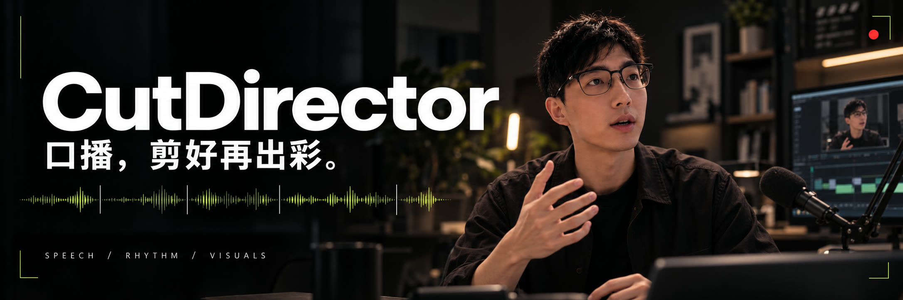

<div align="center">



# CutDirector

**专为已拍口播。剪干净，讲清楚，再让重点出彩。**

一个面向 ChatCut 的口播剪辑 Skill。处理口癖、重录、重复句和节奏，
让字幕、声音与动画跟着你的表达走，而不是抢走观众的注意力。

[](PROMPT-LIBRARY.md)
[](PROMPT-LIBRARY.md)
[](VISUAL-GALLERY.md)

[开始使用](#开始使用) · [看真实效果](#先看真实效果) · [选择动画](PROMPT-LIBRARY.md) · [English](README.en.md)

</div>

## 开始使用

**1. 安装 Skill。** 在支持 Skill Installer 的 Codex 聊天中发送：

```text
$skill-installer install https://github.com/Fangx-AI/cut-director
```

重启 Codex，连接 ChatCut，打开要剪的项目。[其他安装方式与常见问题](references/user-guide.md#安装与更新)

**2. 说出这次想要的结果。** 不需要学习内部规则，也不必一次做完所有环节。

```text
使用 $cut-director 剪辑这条口播。
去无意义口癖、失败重录和重复句，
压缩空等，保留原意与自然语气。
加清楚的字幕和适合内容的动画，
新的视觉风格先做一个片段给我看。
```

也可以只说 **“只去口癖”**、**“节奏紧一点”**、**“只改字幕”** 或 **“给这里加 Logo”**。
已有的原声剪辑和已接受的风格会按这次要求保留。

> 执行需要可访问的音视频与相应 ChatCut 工具；只有逐字稿时可先做方案。Skill 不包含 ChatCut 账号或生成额度。

<a id="已验证效果"></a>

## 先看真实效果

### 品牌随着手势出现

[](assets/verified-prompts/prompt-001-gesture-logo-pop.mp4)

**001 · 手势触发 Logo** · ChatCut 时间线已验证

人物保持全屏。品牌图标在确认的手势时间出现，不挡脸、不抢字幕。

[复制 Prompt](references/prompt-001-gesture-logo-pop.md) · [播放完整视频](assets/verified-prompts/prompt-001-gesture-logo-pop.mp4)

### 左边讲重点，右边给证据

[](assets/verified-prompts/prompt-002-split-screen-explainer.mp4)

**002 · 分屏要点与长文** · ChatCut 时间线已验证

把要点和长文本放进同一镜头；右侧滚动速度与面积可按讲解调整，不必强行展示全文。

[复制 Prompt](references/prompt-002-split-screen-explainer.md) · [播放完整视频](assets/verified-prompts/prompt-002-split-screen-explainer.mp4)

还有[章节导航](references/prompt-004-top-chapter-progress-rail.md)、[三卡翻面](references/prompt-006-editable-three-card-flip.md)、[页面焦点](references/prompt-007-hd-page-focus-lock.md)、[前后对比](references/prompt-014-matched-before-after.md)等。进入 **[15 条动态演示画廊 →](PROMPT-LIBRARY.md)**，按效果选择。

## 不只加特效，先把口播剪好

| 你遇到的问题 | 剪辑时要解决的事 |
| --- | --- |
| “呃……这个，嗯……” | 清理无意义犹豫，保留有效连接词 |
| 同一句拍了几遍 | 留完整、正确、自然的一遍 |
| 反复解释，重点不清楚 | 去冗余，保留新信息与必要强调 |
| 气口太长，剪完又太急 | 压缩空等，保留自然气口，试听接缝 |
| 删句后，字幕和动画错位 | 按剪后原声重对齐字幕与效果 |
| 全程一张脸，信息难记住 | 加适合内容的图形与真实辅助画面 |

**完整剪辑路径**：能听的粗剪 → 对齐的字幕 → 服务表达的画面与声音 → 可编辑项目与按需导出。
小修改直接进入对应环节，不用每次重走全片流程。[看看第一条口播怎么剪](references/user-guide.md)

> **目前的验证范围**：9 条动画在各自的 ChatCut 案例中完成过时间线验证；6 条为本地动画演示。新增语音剪辑规则与时间映射已做合成逻辑测试，**真人素材的误删率、听感与完整导出仍待回归**。品牌封面是概念图，不是产品截图。查看[验证记录](tests/speech-validation.md)。

## 选一个适合你的画面

不用先懂动画术语。先看观众在这一句需要理解什么：

| 这一句要讲什么 | 可以参考 |
| --- | --- |
| 提到品牌，让人认出来 | [001 · 手势 Logo](references/prompt-001-gesture-logo-pop.md) |
| 解释一组要点，旁边需要完整文本 | [002 · 分屏长文](references/prompt-002-split-screen-explainer.md) |
| 长口播中，让人知道讲到哪里 | [004 · 章节与进度](references/prompt-004-top-chapter-progress-rail.md) |
| 告诉观众“看这里” | [007 · 真实页面焦点](references/prompt-007-hd-page-focus-lock.md) |
| 同一对象有什么变化 | [014 · 同构图前后对比](references/prompt-014-matched-before-after.md) |
| 几句话逐步落到一个结论 | [013 · 累积与兑现](references/prompt-013-incremental-payoff.md) |

```text
使用 $cut-director，
参考 Prompt [编号] 处理这句话：
[目标句子或时间段]
沿用原声和风格，先做一个片段。
```

[浏览全部动画](PROMPT-LIBRARY.md) · [连续复制完整 Prompt](PROMPTS.md) · [看 123 条官方参考](VISUAL-GALLERY.md) · [横竖屏变体](references/prompt-variants.md)

## 改到你满意，而不是从头再做

- **“这句别删。”** 恢复对应原声，更新受影响的字幕和效果时间。
- **“字大一点，其他别动。”** 只改相关文字，检查溢出和遮挡。
- **“右边滚慢一点，时长不变。”** 降低滚动速度，不为了展示全文延长视频。
- **“这个风格可以，继续。”** 在已确认范围内延续，不重复问同一个方向。

适用于口播、教程、课程、访谈与人物主导的产品讲解。选题、未拍脚本创作和发布不在此 Skill 的工作范围。

## 一起把口播剪得更好

分享你真正用过的剪辑方法或效果：原片问题、可复用 Prompt、前后结果、验证范围和素材权利。
语音案例尤其欢迎 **误删修正、重录选择、自然气口和字幕重对齐**。

[贡献一个案例](CONTRIBUTING.md) · [报告问题](https://github.com/Fangx-AI/cut-director/issues) · [更新记录](CHANGELOG.md)

<details>
<summary>开发检查与深入文档</summary>

```sh
python scripts/validate_talkdirector.py
python -m unittest discover -s tests
python scripts/check_local_links.py
```

[Skill 定义](SKILL.md) · [完整口播流程](references/talking-head-workflow.md) · [语音规则](references/speech-editing.md) · [宿主兼容](references/compatibility.md) · [研究记录](references/talking-head-research.md) · [演示源文件](assets/prompt-examples/source/README.md)

测试检查合同、剪点与时间映射，不代替实际媒体试听或宿主验证。

</details>

## 授权

代码使用 **AGPL-3.0-or-later**，原创 Prompt 与文档使用 **CC BY-SA 4.0**。
使用 Skill 不会自动改变你自己的成片授权；演示人物、品牌媒体、官方参考和第三方 Logo 有独立边界。

[完整许可](LICENSE) · [署名说明](NOTICE) · [品牌政策](TRADEMARKS.md) · [第三方素材](THIRD_PARTY_NOTICES.md)
