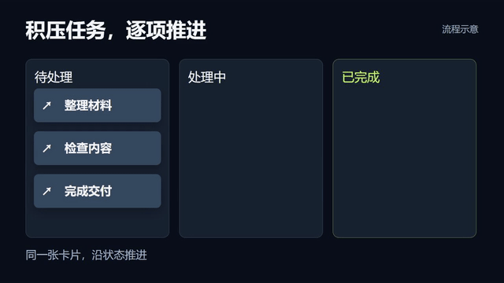

# Prompt 011 · 任务卡片推进看板

**补充素材 · 本地 Remotion 演示。尚未进行 ChatCut 时间线验证。**

[观看 MP4](../assets/prompt-examples/prompt-011-task-board-progression.mp4) · [可编辑源文件](../assets/prompt-examples/source/PromptExamples.tsx)



适合讲解积压处理、协作流程、审查与交付。让观众追踪同一批任务的状态变化；不同于 Prompt 009 的单次“输入—反馈—结果”，也不同于 Prompt 002 的逐项文字讲解。

## 直接使用的 Prompt

```text
在 [目标时间段] 制作一个任务卡片推进看板，用来解释「[流程主题]」。

设置三列「[起始状态]」「[处理中状态]」「[完成状态]」，放入 [2–4 个真实任务名称]。同一张卡片从起始列移动到处理中列，停留到对应步骤讲完，再进入完成列。下一张卡片稍后启动，形成错峰推进。完成时只改变该卡片的颜色并出现勾选标记，卡片文字和身份保持一致，不凭空复制任务。

保留主题、列名、各任务名称、任务数、字体、配色和每张卡片的启动、停留、完成时间为可编辑属性。演示动作绑定实际口播，既不要所有卡片一起飞，也不要为了卡点截断一句话。卡片到达完成列后保留到本段结束，给观众看清结果。

这是后期流程示意，不伪装成真实项目管理软件，不添加未经提供的完成数、效率提升或测试通过率。讲解实际工作状态时，只有证据确认完成的任务才进入完成列；未完成任务留在对应状态。列宽不足时缩短标签、减少同屏任务或分批展示，不能把字号缩到不可读。

沿用原片画幅与声音设置，避开人物、字幕和产品重点。纯示意演示可从约 6 秒起步，根据任务数和口播调整。先展示初始、处理中、部分完成、最终保持帧，并实时检查卡片没有重叠、消失、穿过列名或突然复位，再导出。
```

## 替换项与演示范围

| 项目 | 本地示例 | 使用时 |
|---|---|---|
| 状态 | 待处理 / 处理中 / 已完成 | 换成实际流程状态 |
| 任务 | 整理材料 / 检查内容 / 完成交付 | 使用提供的任务名 |
| 卡片数 | 3 | Prompt 支持 2–4，源示例固定三张 |
| 节奏 | 错峰启动，中列停留，再完成 | 对齐口播语义，不套固定 BPM |

本地源示例通过 props 替换三列、三张卡片和配色，验证三个任务错峰移动及最终保持。两张、四张、未完成分支、不同画幅的完整重排和 ChatCut MG 属性编辑尚需在目标环境验证。提示词要求与当前源示例的实现范围分别标注，不能把示例当作已覆盖全部变体。
