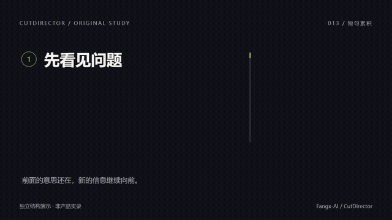

# Prompt 013 · 短句累积与兑现

[返回素材索引](../PROMPT-LIBRARY.md) · [使用指南](user-guide.md)

**状态：本地 Remotion 演示。未进行 ChatCut 时间线验证。**

[](../assets/prompt-examples/prompt-013.mp4)

[打开 MP4（无声）](../assets/prompt-examples/prompt-013.mp4) · [源文件与复现](../assets/prompt-examples/source/README.md)

## 什么时候用

几个原因要合起来才成立，但画面每次都把前一句清空。适合原因递进、方法累积和结论收束。

准备：2–4 条准确短句、一句结论，以及可绑定的语义时间。

## 复制使用

```text
在 [目标时间段] 把 [短句 A]、[短句 B]、[短句 C] 做成逐项累积的画面，最后收束到 [结论]。
第一条落位后保持可读，后续内容沿同一轴增加，不把旧信息缩成角落小字，也不每句清屏。配合真实语义调整入场；每一层增加一个有意义的关系标记，而不是单纯堆装饰。
结论出现时用连线、合并或统一强调表示“这些共同带来结果”。最后保持到观众能读懂，再与下一镜一次性交接。
沿用项目风格，文案、字体、颜色、层间距与时间可编辑。空间不足先缩短可选说明；只有实际内容需要时改为两步。检查最后最拥挤的一帧。
```

## 可以替换什么

短句数量与内容、结论、方向、画幅、项目风格；示例固定三句，其他数量需要目标实现适配。

默认继承已接受的项目风格。插入现有口播时根据实际人物、字幕和素材重排；不要仅凭这个独立示例确定安全区。

## 演示验证边界

本地示例是三句逐步累积后显示结论；无原声，实际词点同步需在目标视频验证。

示例为 1280×720、30fps、6 秒。源代码中的内容可修改；这不等于 ChatCut 属性已验证。其他画幅和超长文案需重新构图与检查。适配当前宿主见[兼容说明](compatibility.md)。

## 来源与授权

结构参考 [cut-motion incremental-stack](https://github.com/Endless1936/cut-motion/blob/main/recipes/incremental-stack.json)。本页指令和示例独立编写，未复制其源码或媒体。

原创 Prompt / 示例媒体按 CC BY-SA 4.0；示例代码按 AGPL-3.0-or-later。署名 CutDirector by Fangx-AI。没有复制外部音乐、人物或产品媒体。
